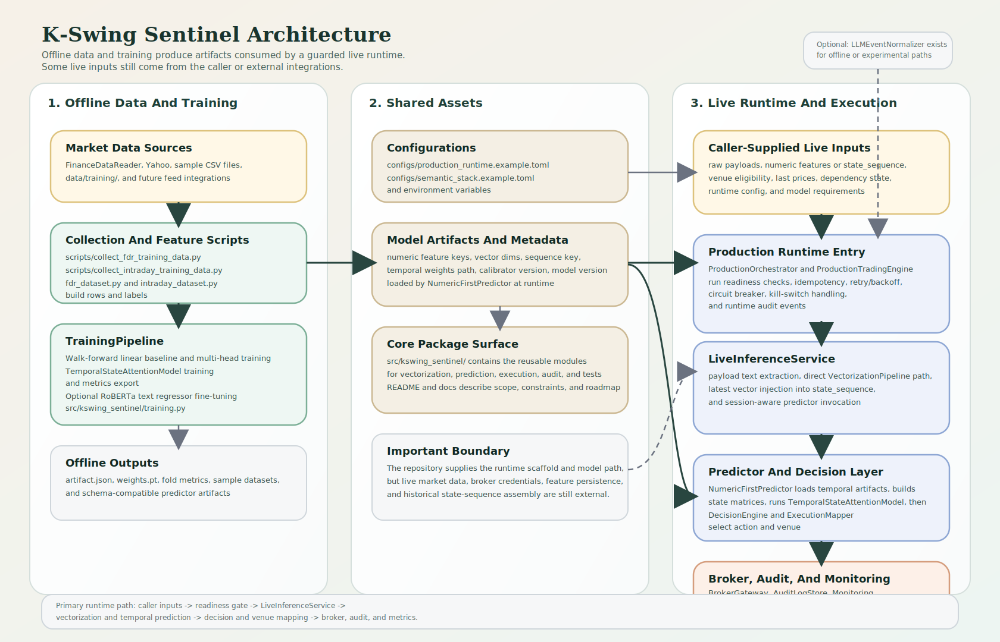
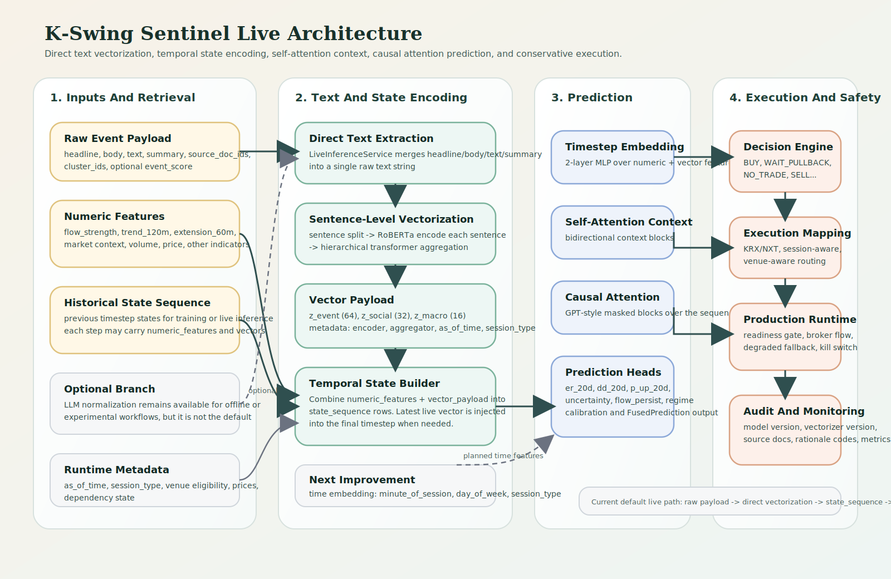

# K-Swing Sentinel v0.1.0

K-Swing Sentinel is a production-oriented Python scaffold for a KRX/NXT swing-trading workflow.
The codebase is strongest in typed contracts, session and venue handling, readiness gates, safe fallbacks, and testable runtime behavior.
It is not yet a turnkey live-trading system with bundled market data and broker connectivity.



The diagram above shows the current repository boundary: offline data collection and training on the left, shared artifacts and configuration in the middle, and the guarded live runtime on the right. The runtime now includes anchor-batch idempotency plus retry/backoff, circuit-breaker, dead-letter capture, persisted dead-letter redrive helpers, and semantic-refresh marking for transient failures, but the live path still expects the caller or external integrations to supply payloads, features, prices, venue eligibility, and dependency state.

## At a Glance

- Good fit if you want to extend a trading-system scaffold with strict schemas, deterministic execution rules, and safety guardrails.
- Less complete if you need a finished live stack, production broker integration, or a full portfolio simulator out of the box.
- Most modules are library-style building blocks. The main developer workflows today are tests, training helpers, data-collection scripts, and runtime integration work.

## What Is Already Implemented

- Pydantic-based contracts and schema validation across the runtime surface
- KRX/NXT session classification, venue-aware routing rules, and conservative execution mapping
- Decision logic, risk-aware trade action selection, and degraded fallback handling
- Cost-aware backtesting utilities with no-lookahead validation
- Walk-forward training scaffolding with linear, multi-head, text-regression, and temporal-transformer artifact export
- Predictor loading for legacy linear and multi-head artifacts plus temporal attention artifacts
- Direct raw-text vectorization with sentence-level RoBERTa encoding, hierarchical transformer aggregation, and a hashing fallback
- Optional LLM event normalization with structured-output validation for experimental or offline paths
- Audit logging, monitoring hooks, anchor-batch orchestration retries/circuit breaking, semantic-refresh scheduling flags, dead-letter JSONL persistence plus persisted-dead-letter redrive helpers, and production readiness checks
- Data-collection scripts and sample training datasets under `data/training/`

## What Is Still Partial

- Live inference exists, but external payloads, numeric features, venue eligibility, last prices, dependency state, and usually historical `state_sequence` inputs still have to be supplied by the caller
- LLM integration supports OpenRouter-style providers, but credentials and provider operations are outside the repository
- The temporal predictor now consumes vector payloads, but historical sequence building and feature persistence are not bundled yet
- The production runtime can retry transient batch failures, mark anchor or event-burst semantic refreshes, persist dead letters when configured, and redrive persisted dead-letter records, but broader operator tooling and a fuller live semantic branch are still not bundled
- The predictor and training pipeline are still baseline scaffolds, not a production-scale research or serving stack
- The backtester enforces execution realism better than a toy simulator, but it is not yet a full event-driven portfolio engine

## What Is Not Included Yet

- Licensed real-time KRX or NXT feeds
- Confirmed live brokerage integration
- Deployment automation, shadow-trading runbooks, and operational procedures
- Full portfolio-level execution, reconciliation, and post-trade lifecycle coverage

## Quick Start

### Prerequisites

- Python `>=3.11`
- Optional for LLM smoke tests: `OPENROUTER_API_KEY`
- Optional for live-runtime experiments: `KRX_FEED_KEY`, `BROKER_API_KEY`, and `BROKER_ACCOUNT_ID`

### Full local environment

Bash:

```bash
python -m venv .venv
source .venv/bin/activate
pip install -r requirements.txt
```

Windows PowerShell:

```powershell
python -m venv .venv
.venv\Scripts\Activate.ps1
pip install -r requirements.txt
```

`requirements.txt` installs the editable package with `dev`, `llm`, `ml`, and `marketdata` extras.

### Minimal development environment

If you only want the test and core runtime surface:

```bash
pip install -e '.[dev]'
```

PowerShell:

```powershell
pip install -e ".[dev]"
```

### Run tests

```bash
python -m pytest -q
```

On restricted environments, you may need to point pytest at a writable temp directory:

```bash
python -m pytest -q --basetemp .tmp/pytest -p no:cacheprovider
```

## Current Model Stack

- Live text path: raw payload text is vectorized directly, without requiring JSON normalization in the default live path
- Text encoder path: sentence-level RoBERTa embeddings are aggregated by a hierarchical transformer into `z_event`, `z_social`, and `z_macro`
- Predictor path: a temporal attention model can consume per-step numeric features plus vector payloads to predict return, drawdown, probability-up, uncertainty, flow persistence, and regime
- Attention layout: timestep embeddings are built with a 2-layer MLP, then passed through self-attention context blocks followed by causal attention blocks
- Compatibility: legacy flat-feature predictor artifacts still load, so older tests and artifacts do not break immediately

### Live Flow Detail



## Common Commands

Run a focused test module:

```bash
python -m pytest -q tests/test_production_runtime.py
python -m pytest -q tests/test_venue_router.py
python -m pytest -q tests/test_training_pipeline_artifacts.py
python -m pytest -q tests/test_live_direct_vectorization.py
python -m pytest -q tests/test_vectorization_metadata.py
python -m pytest -q tests/test_temporal_transformer_predictor.py
```

Collect a small FinanceDataReader dataset:

```bash
python scripts/collect_fdr_training_data.py --symbols 005930 000660 035420
```

Collect multi-timeframe Yahoo-based sample datasets:

```bash
python scripts/collect_intraday_training_data.py --symbols 005930 000660 --prefix krx_sample
```

Smoke-test the optional LLM normalizer path:

```bash
python scripts/smoke_test_grok.py
```

## Runtime Entry Points

There is no polished end-user CLI yet. The main integration points are Python classes:

- [`src/kswing_sentinel/production_runtime.py`](src/kswing_sentinel/production_runtime.py)
  - `ProductionRuntimeConfig`
  - `ProductionReadinessGate`
  - `ProductionTradingEngine`
  - `ProductionOrchestrator`
- [`src/kswing_sentinel/live.py`](src/kswing_sentinel/live.py)
  - `LiveInferenceService`
- [`src/kswing_sentinel/training.py`](src/kswing_sentinel/training.py)
  - `TrainingPipeline`
- [`src/kswing_sentinel/predictor.py`](src/kswing_sentinel/predictor.py)
  - `NumericFirstPredictor`
  - `TemporalStateAttentionModel`

The current live path expects the caller to provide:

- symbols
- raw event payloads
- numeric features or a `state_sequence`
- venue eligibility flags
- last prices
- runtime dependency state
- runtime config
- model requirements

If a temporal predictor artifact is loaded, the most useful input shape is a `state_sequence` whose steps contain `numeric_features` and optional vector payloads. If only flat features are provided, the predictor falls back to a single-step sequence. That keeps the core logic testable, but it also means this repository does not yet include the surrounding production services needed for live deployment.

`ProductionOrchestrator` now wraps anchor batches with retry/backoff, circuit-breaker protection, dead-letter capture, optional JSONL persistence via `dead_letter_log_path`, persisted-dead-letter redrive helpers, and anchor-level idempotency. `ProductionTradingEngine` also memoizes per-symbol results within an anchor so batch retries do not resubmit already completed orders in the same process, and it records semantic-refresh requests for the documented refresh anchors or event-burst payloads.

## Configuration and Data

- [`configs/production_runtime.example.toml`](configs/production_runtime.example.toml)
  - Trading mode selection
  - Required environment variables
  - Kill switch path
  - Audit, metrics, and dead-letter log paths
- [`configs/semantic_stack.example.toml`](configs/semantic_stack.example.toml)
  - Search provider settings
  - LLM provider and model settings
  - Encoder backend and model settings
- [`data/training/`](data/training/)
  - Sample daily, 60-minute, and 15-minute feature datasets

## Repository Layout

```text
configs/                  Example runtime and semantic-stack configuration
data/training/            Sample training datasets
docs/                     Architecture notes and roadmap documents
enc/                      Experimental encoder prototype
scripts/                  Data collection and smoke-test helpers
src/kswing_sentinel/      Core implementation
tests/                    Unit tests for contracts, runtime behavior, and guardrails
TODO.md                   Working implementation checklist
```

## Key Documents

- Architecture and operating rules: [`docs/k_swing_sentinel_v1_2.md`](docs/k_swing_sentinel_v1_2.md)
- Temporal predictor and vector path: [`docs/temporal_predictor_architecture.md`](docs/temporal_predictor_architecture.md)
- Approach and differentiators: [`docs/approach_differentiators.md`](docs/approach_differentiators.md)
- Roadmap draft: [`docs/ROADMAP_GITHUB_ISSUES.md`](docs/ROADMAP_GITHUB_ISSUES.md)
- Detailed implementation notes: [`docs/implementation_todo.md`](docs/implementation_todo.md)
- Dead-letter recovery runbook: [`docs/runbooks/dead_letter_recovery.md`](docs/runbooks/dead_letter_recovery.md)
- Current task checklist: [`TODO.md`](TODO.md)

## Current Priorities

- Build and persist historical timestep sequences for the temporal predictor path
- Replace remaining scaffold-level temporal predictor pieces with stronger trained artifacts
- Connect live runtime inputs to real feature, event, and venue-eligibility sources
- Expand execution realism, temporal labels, and portfolio simulation
- Expand operator tooling and recovery workflows around persisted dead letters
- Upgrade semantic refresh from policy flags to a fuller optional live semantic branch
- Keep README, TODOs, and architecture documents aligned with actual implementation status
