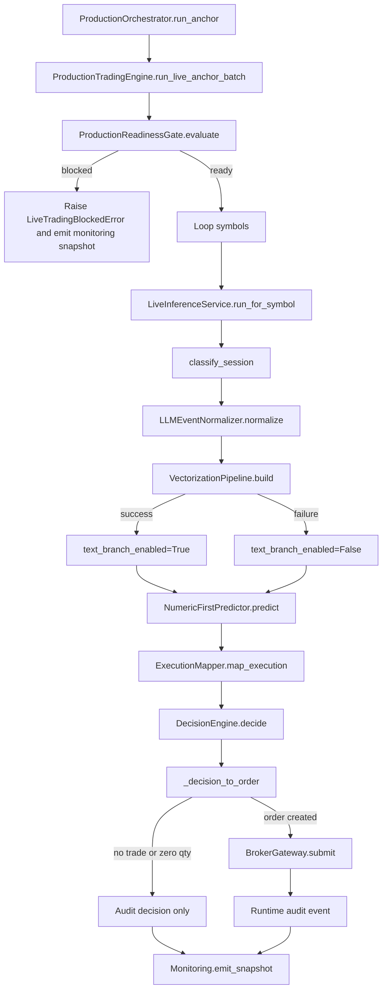

# K-Swing Sentinel v0.1.0

K-Swing Sentinel is a production-oriented Python scaffold for a KRX/NXT swing-trading workflow.
The repository currently focuses on strict schemas, deterministic session handling, safe fallbacks, and testable runtime behavior.

## Current Status

Status checked on 2026-03-22: this repository is an executable scaffold, not just a planning document.

- Test status: `python -m pytest -q` -> `70 passed`
- Verified runtime: Python `3.12.10`
- Repository state: core domain logic and guardrails are implemented, while live market/broker connectivity is still partial

## What Is Implemented

- Pydantic-based typed contracts and schema validation
- KRX/NXT session classification and venue-aware execution mapping
- Decision engine, risk-oriented trade action selection, and conservative fallbacks
- Cost-aware backtester with no-lookahead validation
- Walk-forward training scaffold with artifact export
- Numeric-first predictor that can load local JSON model artifacts
- LLM event normalizer with strict structured-output validation and degraded fallback
- RoBERTa-based text vectorization pipeline with hierarchical aggregation, local model download support, and hashing fallback
- Trainable RoBERTa text-regression path so the backbone can be fine-tuned instead of using fixed embeddings
- Production readiness gate, runtime audit logging, monitoring, and orchestration helpers
- Data collection scripts for FinanceDataReader and Yahoo-based training samples
- Example runtime/config files and sample training datasets under `data/training/`

## Partially Implemented

- Live inference flow exists, but real production deployment still depends on external market data, broker APIs, and environment configuration
- LLM integration supports OpenRouter-compatible providers, but API keys are not stored in the repository
- RoBERTa mean-pooling activates when `transformers` and `torch` are installed; otherwise the encoder falls back to hashing-based embeddings
- The new text fine-tuning path is minimal and task-specific; it is not yet wired into the numeric predictor or live runtime by default
- Predictor/training pipeline is a lightweight baseline scaffold, not yet a production-grade LightGBM/CatBoost stack
- Backtesting supports execution parity and session-aware cost handling, but is not yet a full event-driven portfolio simulator

## Not Yet Production-Ready

- Licensed real-time KRX/NXT feeds are not bundled with this repository
- Broker order routing is represented by gateway abstractions and tests, not by a confirmed live brokerage integration
- Intraday provisional flow archive and venue microstructure coverage are not guaranteed from the checked-in data alone
- Operational runbooks, deployment automation, and full live shadow-trading procedures are still incomplete

## Key Files

- Architecture and operating rules: `docs/k_swing_sentinel_v1_2.md`
- Current issue-style roadmap: `docs/ROADMAP_GITHUB_ISSUES.md`
- Working task list: `TODO.md`
- Hierarchical encoder prototype: `enc/Model.py`
- Core schemas: `src/kswing_sentinel/schemas.py`
- Live/runtime gate: `src/kswing_sentinel/production_runtime.py`
- Live inference path: `src/kswing_sentinel/live.py`
- Backtester: `src/kswing_sentinel/backtester.py`
- Training scaffold: `src/kswing_sentinel/training.py`

## Current Live Flow

The current live path is centered on `ProductionTradingEngine.run_live_anchor_batch()` and expects
payloads, numeric features, venue eligibility, and last prices to be supplied by the caller.



### Flow Notes

- `LLMEventNormalizer` and `VectorizationPipeline` already have degraded fallbacks, so the live path can continue in numeric-only mode.
- The vectorizer currently validates the text branch and records metadata, but its output vectors are not yet fused into the predictor input used by `NumericFirstPredictor`.
- `RiskEngine` and `PortfolioEngine` exist in the repository, but they are not yet inserted into the production order path between `DecisionEngine` and `BrokerGateway`.
- `TemporalLikeOrchestrator` provides retry/circuit-breaker semantics, but it is still separate from the production orchestrator path shown above.

## Quick Start

### 1. Create an environment

```bash
python -m venv .venv
source .venv/bin/activate
pip install -e .[dev,llm,ml,marketdata]
```

Windows PowerShell:

```powershell
python -m venv .venv
.venv\Scripts\Activate.ps1
pip install -e .[dev]
```

### 2. Run tests

```bash
python -m pytest -q
```

### 3. Optional extras

If you want local LLM or ML dependencies:

```bash
pip install -e .[dev,llm,ml]
```

That enables the `transformers`/`torch` path used by the default Korean RoBERTa encoder (`klue/roberta-base`).

If you want market-data collection helpers:

```bash
pip install -e .[dev,marketdata]
```

## Common Commands

Run a focused test module:

```bash
python -m pytest -q tests/test_production_runtime.py
python -m pytest -q tests/test_venue_router.py
python -m pytest -q tests/test_training_pipeline_artifacts.py
```

Collect small sample datasets:

```bash
python scripts/collect_fdr_training_data.py --symbols 005930 000660
python scripts/collect_intraday_training_data.py --symbols 005930 000660
```

## Repository Layout

```text
configs/                  Example runtime and semantic-stack configuration
data/training/            Sample training datasets
docs/                     Architecture notes and roadmap
scripts/                  Data collection and smoke-test helpers
src/kswing_sentinel/      Core implementation
tests/                    Unit tests for runtime behavior and guardrails
```

## Next Priorities

- Replace remaining baseline components with stronger production-grade model artifacts
- Harden live broker/runtime integration around real dependency checks
- Expand portfolio simulation and execution realism
- Clarify README/TODO/docs so implemented vs planned scope stays aligned

## Roadmap References

- Architecture: `docs/k_swing_sentinel_v1_2.md`
- GitHub issue draft roadmap: `docs/ROADMAP_GITHUB_ISSUES.md`
- Detailed implementation notes: `docs/implementation_todo.md`
